# Imperium 🏛️

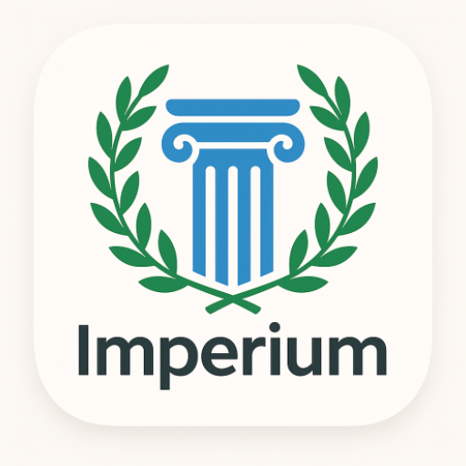

---

## 📚 Introduction

**Imperium** is a modern, interactive history quiz app designed to make learning about world history fun and engaging. Explore ancient civilizations, the medieval era, the Renaissance, modern history, and the world wars through beautifully crafted quizzes, progress tracking, and a gamified experience. 

> _"The more you know about the past, the better prepared you are for the future."_  
> — Theodore Roosevelt

---

## ✨ Features

- 🏆 **Multiple Historical Eras**: Ancient, Medieval, Renaissance, Modern, and World Wars
- 🎨 **Material Design 3 UI**: Smooth, modern, and responsive interface
- 📊 **Interactive Progress Charts**: Pinch-to-zoom, swipe gestures, and animated statistics (powered by MPAndroidChart)
- 🧠 **Challenging Quizzes**: Hundreds of questions across categories and levels
- 🗂️ **Level & Category Progression**: Unlock new levels and track your mastery
- 🥇 **Achievements & Badges**: Earn badges as you progress
- 👤 **Profile & Stats**: View your achievements, stars, and quiz history
- 🔊 **Sound & Music**: Immersive background music and sound effects
- 🌙 **Dark/Light Theme Ready**: Consistent experience in any lighting
- 🚀 **Offline Support**: Play quizzes anytime, anywhere

---

## 🖼️ Screenshots

| Home | Levels | Ancient Quiz | Medieval Quiz |
|:---:|:---:|:---:|:---:|
| 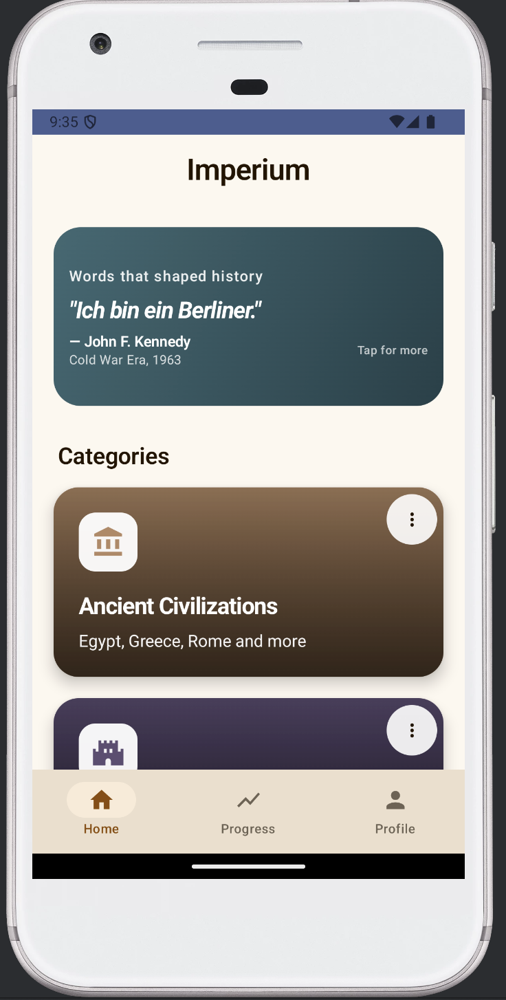 | 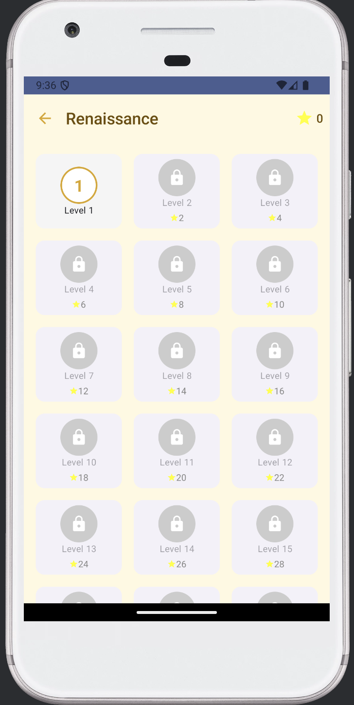 | 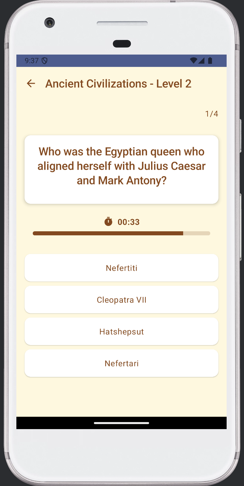 | 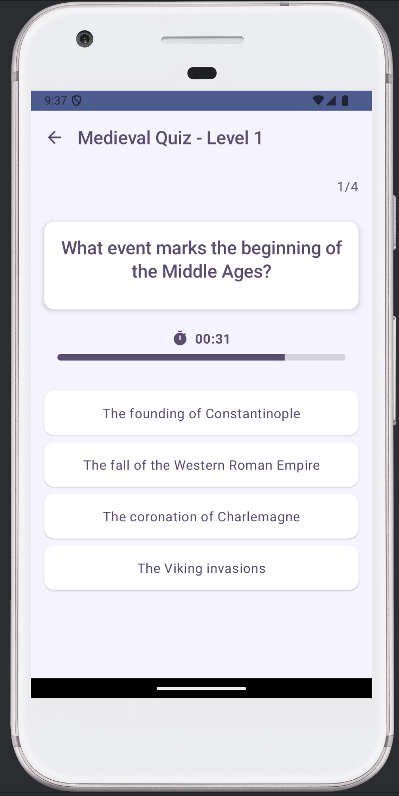 |
| 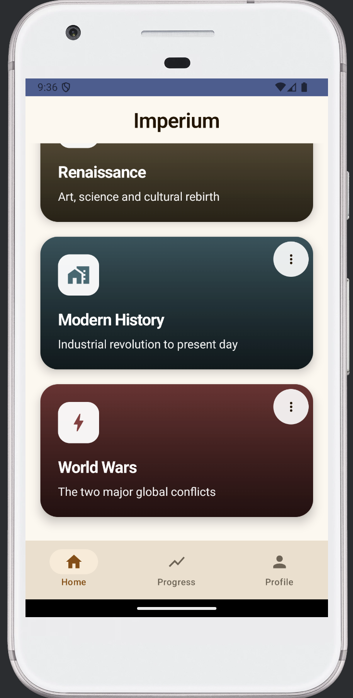 |   |   |   |

| Renaissance | Modern History | World Wars | Progress |
|:---:|:---:|:---:|:---:|
| 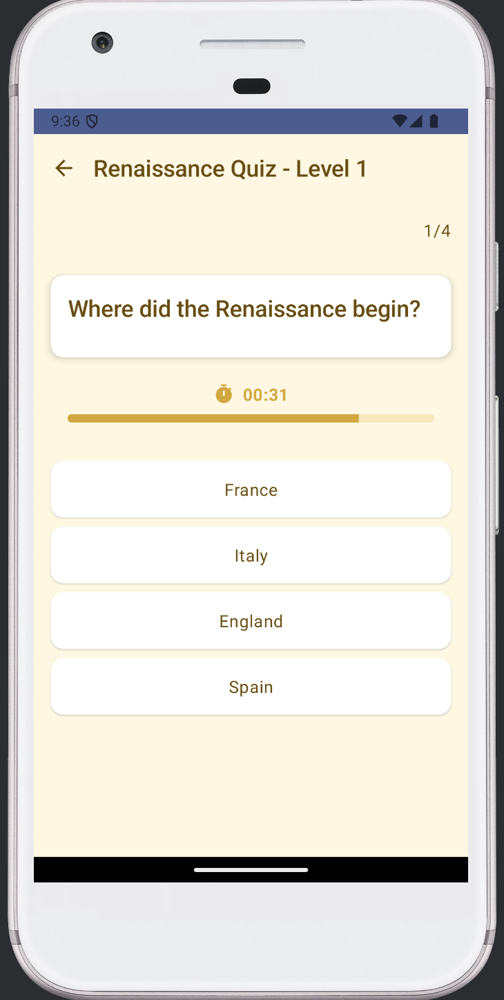 | 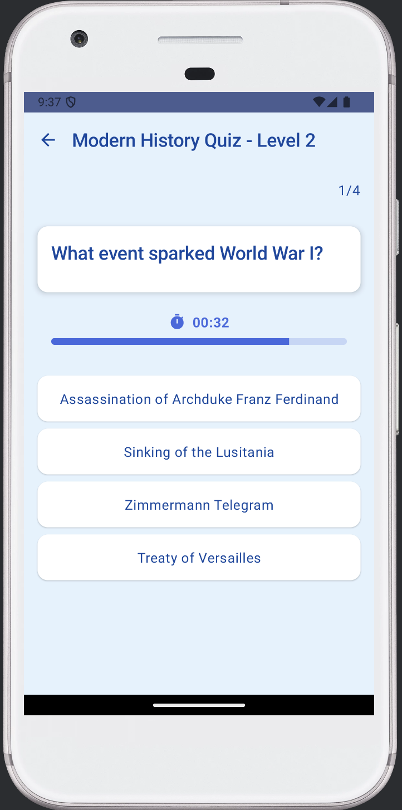 | 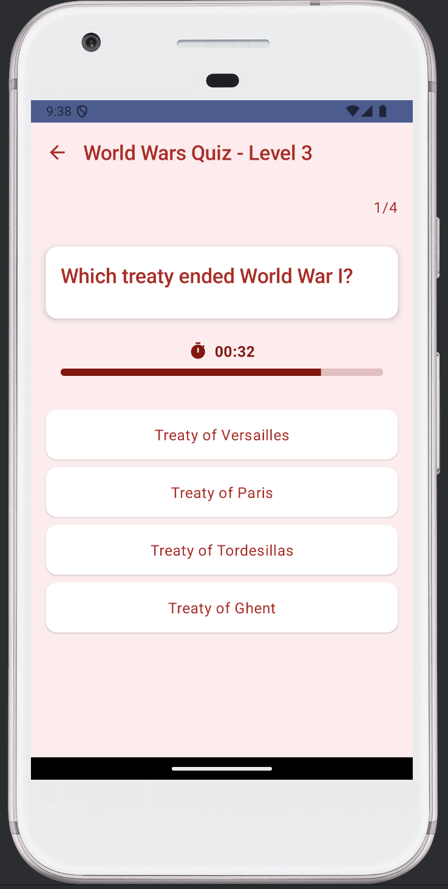 | 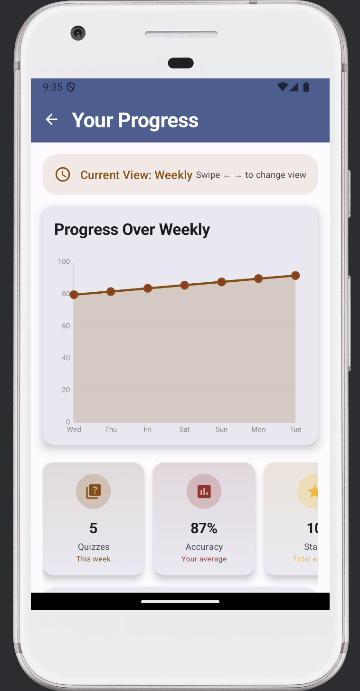 |

| Profile | About |
|:---:|:---:|
| 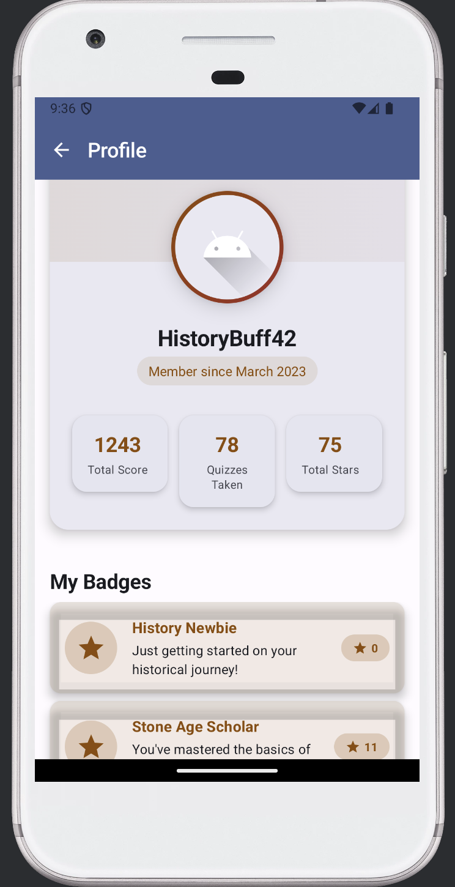 | 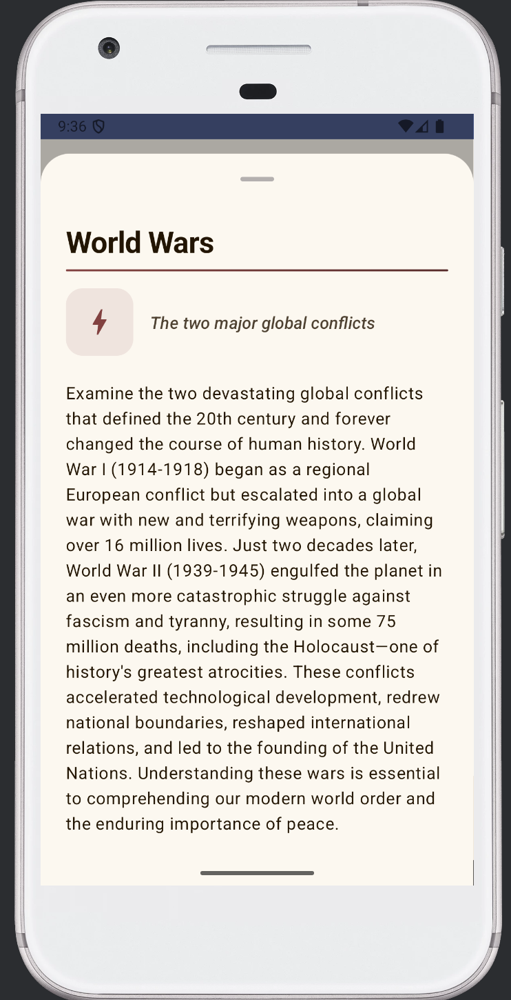 |

**Captions:**
- Home: Main dashboard with navigation and categories
- Levels: Level selection for a category
- Ancient/Medieval/Renaissance/Modern/World Wars: Quiz screens for each era
- Progress: Interactive progress and statistics
- Profile: User profile and achievements
- About: App information and credits

---

## 🛠️ Tech Stack

- **Kotlin** & **Jetpack Compose** (UI)
- **Room** (local database)
- **Hilt** (dependency injection)
- **Retrofit** (network/API)
- **MPAndroidChart** (interactive charts)
- **WorkManager** (background tasks)
- **Material Design 3**

---

## 🏗️ Architecture

- **MVVM** (Model-View-ViewModel) pattern
- **Repository** pattern for data management
- **Composable UI**: Reusable, modular components
- **Room Database**: For quiz data, user progress, and achievements
- **Navigation**: Bottom navigation bar for Home, Progress, and Profile
- **Background Services**: For badge/achievement updates

---

## 🚦 Getting Started

### Prerequisites
- Android Studio Hedgehog or newer
- Android SDK 33+

### Build & Run
1. **Clone the repository:**
   ```bash
   git clone https://github.com/yourusername/imperium.git
   cd imperium
   ```
2. **Open in Android Studio**
3. **Build the project** (Gradle will auto-download dependencies)
4. **Run on emulator or device**

---

## 📦 Dependencies

- [Jetpack Compose](https://developer.android.com/jetpack/compose)
- [Room](https://developer.android.com/jetpack/androidx/releases/room)
- [Hilt](https://dagger.dev/hilt/)
- [Retrofit](https://square.github.io/retrofit/)
- [MPAndroidChart](https://github.com/PhilJay/MPAndroidChart)
- [WorkManager](https://developer.android.com/topic/libraries/architecture/workmanager)

---

## 🤝 Contributing

Pull requests are welcome! For major changes, please open an issue first to discuss what you would like to change.

1. Fork the repo
2. Create your feature branch (`git checkout -b feature/AmazingFeature`)
3. Commit your changes (`git commit -m 'Add some AmazingFeature'`)
4. Push to the branch (`git push origin feature/AmazingFeature`)
5. Open a Pull Request

---

## 👤 Author

**Hikmet Bozkurt Aydoğan**  
[LinkedIn](https://www.linkedin.com/in/hikmetbozkurt/)  
[Email](mailto:hkmtbzkrt06@gmail.com)

---

## 🙏 Credits & License

- App icon and some illustrations by [Freepik](https://www.freepik.com/) and [Flaticon](https://www.flaticon.com/)
- Quiz content and historical data: [Wikipedia](https://wikipedia.org/), [History.com](https://history.com/)
- This project is licensed under the MIT License.

---

> Made by Hikmet Bozkurt Aydoğan
